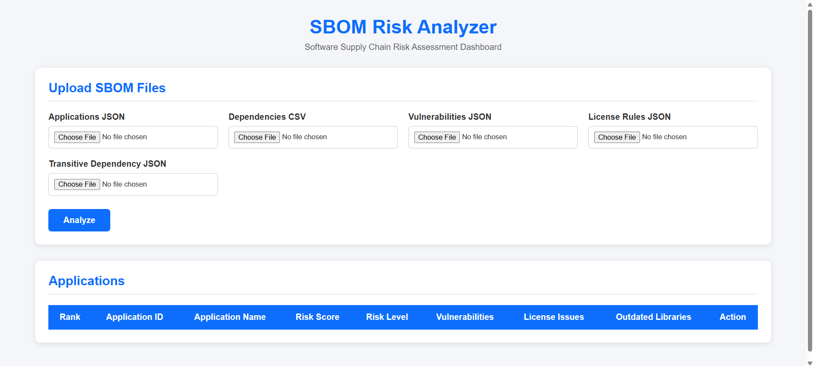
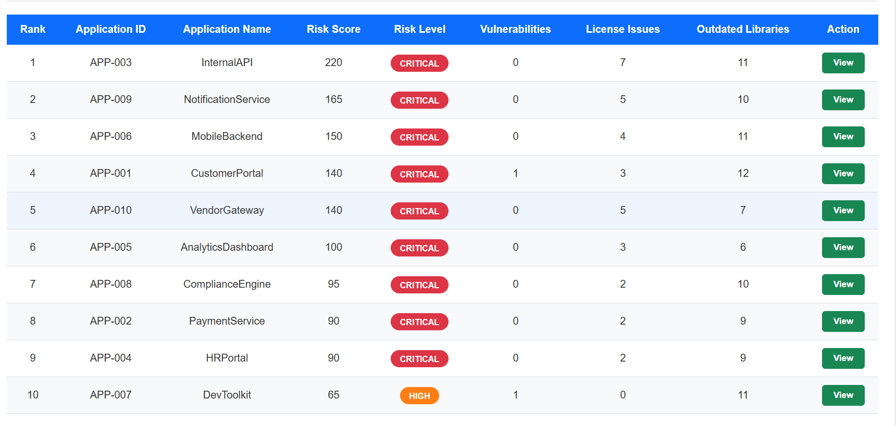
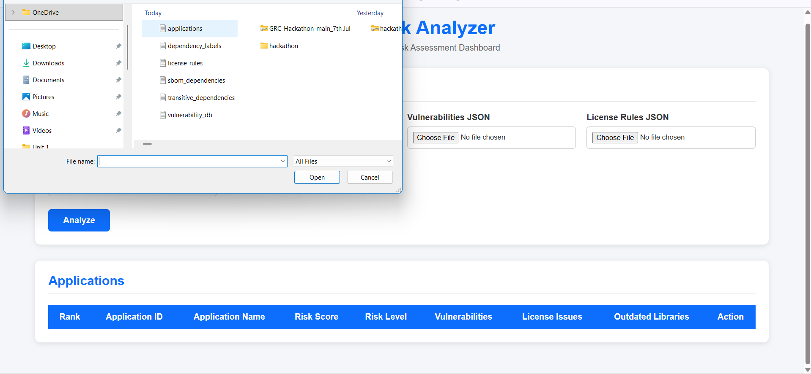
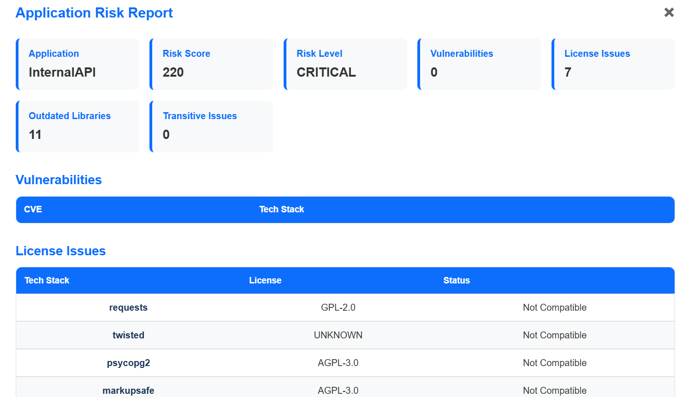

# Team 404 
Societe Generale Hackathon Project

# SBOM Risk Analyzer

## Overview

SBOM Risk Analyzer is a full-stack web application that analyzes a Software Bill of Materials (SBOM) to identify software supply chain risks. The system evaluates applications based on vulnerabilities, license compatibility, outdated dependencies, and transitive dependency relationships, providing an overall risk assessment along with remediation recommendations.

The application enables organizations to gain better visibility into the security and compliance risks associated with third-party software components.

---

## Features

- Upload and process SBOM datasets
- Parse application and dependency information
- Construct dependency graphs for transitive dependency analysis
- Detect known software vulnerabilities
- Perform license compatibility analysis
- Identify outdated libraries
- Calculate a composite risk score
- Classify applications into risk levels
- Generate remediation recommendations
- Display results through an interactive web dashboard

---

## Technology Stack

### Frontend
- HTML5
- CSS3
- JavaScript

### Backend
- Java
- Spring Boot
- Spring Data JPA

### Database
- MySQL

### Build Tool
- Maven

---

## System Architecture

```
                User
                  │
                  ▼
        HTML, CSS, JavaScript
                  │
            REST API Requests
                  │
          Spring Boot Backend
                  │
      ┌───────────────────────────┐
      │   Risk Analysis Engine    │
      │                           │
      │ • Dependency Graph        │
      │ • Vulnerability Analysis  │
      │ • License Analysis        │
      │ • Outdated Detection      │
      │ • Risk Score Calculation  │
      └───────────────────────────┘
                  │
                  ▼
                MySQL
```

---

## Project Structure

```
src
├── controller
├── service
├── repository
├── entity
├── parser
├── dto
└── resources
    └── data
```

---

## Workflow

1. Upload the required SBOM dataset files.
2. Parse applications, dependencies, vulnerabilities, license rules, and transitive dependencies.
3. Store the parsed information in the database.
4. Construct the dependency graph.
5. Analyze direct and transitive dependencies.
6. Identify known vulnerabilities.
7. Check license compatibility.
8. Detect outdated libraries.
9. Calculate the overall risk score.
10. Generate recommendations and display the results.

---

## Risk Analysis

The application evaluates software components using the following criteria:

### Vulnerability Analysis

- Detects known CVEs
- Evaluates CVSS severity
- Checks patch availability
- Recommends fixed versions

### License Compatibility

- Verifies license compatibility with proprietary software
- Identifies restrictive or incompatible licenses
- Generates replacement recommendations

### Dependency Analysis

- Builds dependency graphs
- Traverses transitive dependencies
- Identifies indirect risks

### Outdated Library Detection

- Detects libraries that have not been maintained
- Highlights obsolete software components

---

## Risk Score

The overall risk score is calculated by combining:

- Vulnerability severity
- License compatibility issues
- Outdated dependencies
- Transitive dependency risks

Applications are classified into the following categories:

| Risk Score | Risk Level |
|------------|------------|
| 0 – 24 | Low |
| 25 – 49 | Medium |
| 50 – 74 | High |
| 75 and above | Critical |

---

## REST APIs

### Upload Dataset

```
POST /api/upload
```

Uploads and processes the required dataset files.

---

### Analyze All Applications

```
GET /api/analyze/all
```

Returns a summary risk report for all applications.

---

### Analyze a Single Application

```
GET /api/test/{applicationId}
```

Returns the detailed risk report for a specific application.

---

## Dashboard

The dashboard provides:

- Application risk summary
- Risk score and classification
- Vulnerability information
- License compatibility issues
- Outdated libraries
- Recommendations for remediation

---

## Prerequisites

- Java 17
- Maven
- MySQL 8.x
- IntelliJ IDEA (recommended)

## Installation

1. Clone the repository

```bash
git clone https://github.com/Usmanhishams/Team-404---SBOM-Analyzer.git
```

2. Navigate to the project

```bash
cd Team-404---SBOM-Analyzer
```

3. Configure MySQL in `application.properties`

4. Run the Spring Boot application

5. Open

```
http://localhost:8080 or http://localhost:8080/index.html
```

## Input Files

Upload the following files:

- applications.json
- dependencies.csv
- vulnerabilities.json
- license_rules.json
- transitive_dependency.json

## Output

The application generates:

- Risk Score
- Risk Level
- Vulnerability Report
- License Compatibility Report
- Outdated Libraries
- Recommendations

# Screenshots

## Dashboard



---

## Risk Report



---

## Upload Page



## details Page



## Future Enhancements

- Support for CycloneDX and SPDX SBOM formats
- Single ZIP package upload
- PDF report generation
- Interactive dependency graph visualization
- Authentication and user management
- Integration with live vulnerability databases
- Risk trend analysis
- Email notifications

---

## Conclusion

SBOM Risk Analyzer simplifies software supply chain risk assessment by automating vulnerability detection, license compliance verification, dependency analysis, and risk reporting. The system provides organizations with actionable insights that help improve the security, maintainability, and compliance of software applications.